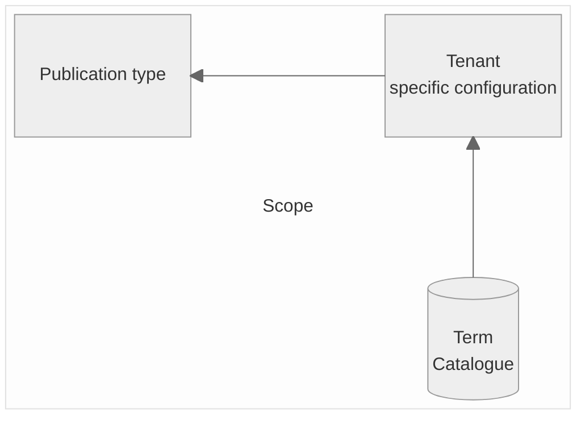
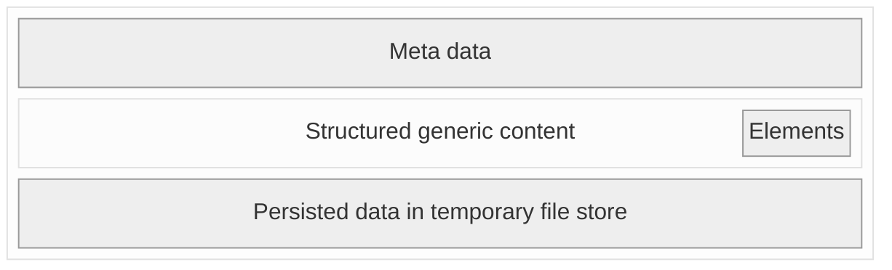

# The publication standard

The future publication standard (occasionally referred to as "Schema 2.0") can be considered as the centrepiece of the official gazette portal.
> [!TIP]
> To get a better understanding of the interaction between the individual artifacts, it is recommended to read ["Big Picture"](https://github.com/officialgazette/big-picture) first.

> [!IMPORTANT]
> The existing concepts and artifacts should be challenged and revised. An optimal publication standard is to be drafted as part of the public tender. In particular, it should
>- enable a seamless exchange of publications
>- be scalable (e.g. with regard to the inclusion of new tenants or new publication types)
>- be developer-friendly 

The most important terms regarding the standardisation can briefly be explained as follows:

> **Publication:** 
> The announcement to be published or already published in an official gazette. The term publication is also used after publishing.
>
> **Publication type:** 
> A type of a publication. Defined as a blueprint of recurring thematically or structurally identical publications.
>
> **Publication standard:**
> Since the beginning of 2023, efforts have been made to set up new official gazettes on the portal according to a standardized procedure. Building on this basis, a publication standard is to be developed and established with the new solution.
>
> **Publication metadata:** 
> Metadata contains information about the data in the publication content and is descriptive in nature. In the present case, the metadata also serves as a minimum data set for the search index, i.e. metadata can be used to search, regardless of whether it is an old publication in the temporary file store or a valid publication in the core system.
>
> **Publication content:** 
> The information on the actual content of a publication can be found in the publication content.
>
> **Publication element:**
> 
> A publication type is made up of individual elements. Each notification element has a unique key, but different characteristics.
> Note: In this context, the term “element” should not be confused with the element term in the XML language. For example, an element can be a “private person” or a “company”.
> For more information on the structure of an element, see “the content structure” below.


## Considerations regarding the existing schema

In recent years, various preparatory work has been carried out for the introduction of a new, holistic standard. In particular

* A minimum set of metadata common to all publications was defined. This set enables (and should enable in a future solution) a standardised search of both published and archived publications. Information regarding the existing meta data schema can be found [here](https://amtsblattportal.ch/docs/api/#_api_reference).

* a generic structure for message content was created. This makes it possible to deliver and obtain publications of very different types and from several public authorities in a standardised structure. More Information regarding the generic content structure can be found [here](https://amtsblattportal.ch/docs/api/#_publication_schema_2_0).


## The scope of the Standard
The field of action with regard to standardization comprises various aspects. The following overview shows Which artifacts are subject to closer consideration regarding for the future standard.


The individual artifacts are described in the following sections.

### The general structure of a publication type

> [!TIP]
> In the existing solution, the structure schema is available in XSD format, [see here](https://github.com/officialgazette/publication-standard/blob/main/publication_schema.xsd).

The structure of the publication describes how a publication is organized and can be requested and submitted via the API. 




A distinction must be made between

* The meta data: Meta data should be as identical as possible for each publication type, and they should be used for both expired (possibly archived) and future publications.

* The content data: Content data varies significantly depending on the type of publication. Therefore, a solution had to be found to keep the basic structure stable but adapt the actual content data for each publication type.

### The meta data
The structure and elements of the existing meta data schema is documented [here](https://amtsblattportal.ch/docs/api/#_api_reference). For reasons of downward compatibility, it may be a good approach to keep this structure in a future solution/standardisation.

### The content data

**Semantic structuring**

The current content schema consists of four elements that give the publication a semantically usable structure:

* controls

Contains the configuration controls as boolean values (e.g.: "apiImport" must be set "true" when importing a publication via API)

* location

Describes the assignment of the publication to a municipality. If a message cannot be assigned to a municipality, this element remains empty.

* action

Describes the nature of a publication

* businessCase

Describes the business case on which the publication is based.

* reaction

Describes the possible reactions to a publication


**The content structure**

The following figure shows the content structure of a publication:


Each element has an element key and a term in German or French (a future solution should provide Italian and English as well, see "general terms catalogue"). 
The element is also typified by means of a "valueType" element. The following schema excerpt shows the possible elements.

**key:** Contains the key of the term. This uniquely identifies the term, even if the term is renamed on a client-specific basis (for example, a "building application" may be called a "building project", depending on the publication organ).

**type:** Describes the type of term from a technical perspective:
- action
- businessCase
- businessTerm
- enumValue
- reaction
- municipalityId

**valueType:** Describes the type of term from a technical/structural perspective:
- text
- textNeutral
- richtext
- int
- enum
- date
- dateFromTo
- datetime
- address
- legalPerson
- naturalPerson
- naturalPersonLight
- naturalLegalPerson
- deceasedPerson
- url
- attachment

These types are mapped in the XML schema, further information on the structure can be found in the [API doc of the official gazette portal](https://amtsblattportal.ch/docs/api).
  
### The terms catalogue 
The collection of general terms (also referred to as the term database) includes all terms that can be used in publication types. These terms are maintained in German, French, Italian and English and have a unique key.

**Structure of a term**
The terms catalogue can currently be accessed in JSON format at the following URL: https://amtsblattportal.ch/terms 
A term object ("term") contains various information and is structured as follows:
```
{
"key" : "constructionProject",
"valueType" : "text",
"term" : {
  "de" : "Planning application",
  "fr" : "Demande d'autorisation de construire"
  }
}
```


> [!TIP]
> In the existing solution, the terms catalog is structured in a publication type-centered manner. This concept should be challenged. The catalog structure can and should be revised as part of the new concept.

### Tenant-specific configurations
Publishers of an official gazette should be able to configure their publication types autonomously. The exchange of this configuration should also be standardized.
These configurations include in particular
  - Assignment and editing of preconfigured default publication types from the terms catalogue
  - Individualization of publication type naming
  - The possibility to customize the terms of the publication elements by the tenant (n.b.: in the current solution these terms can be edited by publishing entities when creating the publication)
  - A Link to a page with further information on the publication type (description, sample publication, etc.)
  - Text for the individual notification elements (default content) should be provided
  - Legal remedies of the specific publication types
  - Which publication fees apply
  - The publication period
  - The publication interval (on which days of the week a publication should be published)
  - Archiving requirements (Is a publication worthy of archiving or can it be deleted)
  - May published publications be obtained via API
  - Which elements should be worthy of protection (e.g. which elements may not be available via API, usually personal data)
  - It should be displayed which official gazettes also use a certain publication type (including external official gazettes)
  - Further publication type-specific settings

An example of a current client-specific configuration (Canton Valais) can be found [here](https://amtsblattportal.ch/terms/kabvs)


