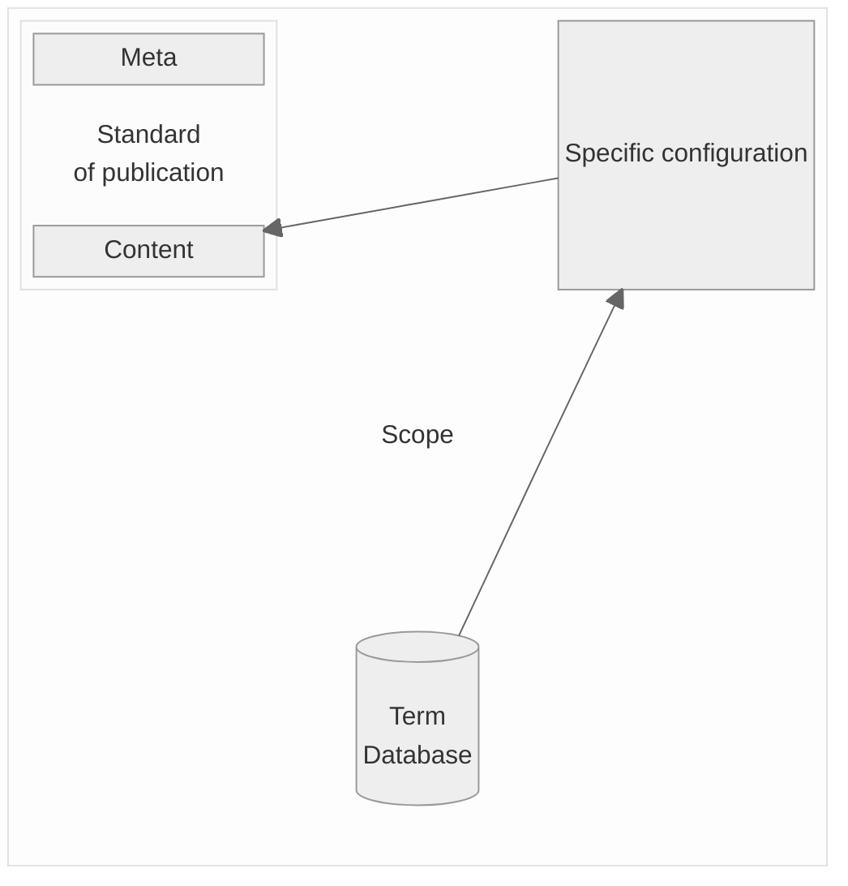

# The publication standard

The future publication standard (occasionally referred to as "Standard 2.0") can be considered as the centrepiece of the official gazette portal.

> [!TIP]
> To get a better understanding of the interaction between the individual artifacts, it is recommended to read ["Big Picture"](https://github.com/officialgazette/big-picture) first.

> [!IMPORTANT]
> The existing concepts and artifacts should be challenged and revised. An optimal standard is to be drafted as part of the tender. In particular, it should
>- ensure the interoperability of the future system
>- be scalable (e.g. with regard to the inclusion of new tenants or new publication types)
>- be developer-friendly 


## Why a standard?

The growing number of official publications in the official gazette portal shows that the introduction of a standard that applies to all types of publications is unavoidable. A standardised reporting structure offers a number of advantages:

- A uniform standard ensures the interoperability of the system.  It furthermore ensures that the publications remain readable and processable at a future time.
- The import and export of publications is simplified and each publication type can be processed in the same way.
- The schemes are easier to read once the basic principles have been understood.
- The new publication structure follows universal semantics that apply to all publication types. Wherever possible, the schema structure is based on the existing eCH standards.

## Considerations regarding the standard

In recent years, various preparatory work has been carried out for the introduction of a new, holistic standard. In particular

* A minimum set of metadata common to all publications was defined. This set will enable a standardised search of both published and archived notifications in the future. The meta data standard can be found here.

* a generic structure for message content was created. This makes it possible to deliver and obtain notifications of different notification types and public authorities in a standardised structure.


## The scope of the Standard
The field of action with regard to standardization comprises various aspects and artefacts. The following overview shows which artifacts are expected for the future standard.


The individual artifacts are described in detail as follows.

### The structure of a publication
Describes the basic structure of how a publication is organized and can be requested and submitted via the API. A distinction must be made between

* The meta data: Meta data should be as identical as possible for each publication type, and they should be used for both expired (possibly archived) and future publications.

* The content data: Content data varies significantly depending on the type of publication. Therefore, a solution had to be found to keep the basic structure stable but adapt the actual content data for each publication type.
 
> [!TIP]
> In the existing solution, the structure schema is available in XSD format, [see here](https://github.com/officialgazette/publication-standard/blob/main/publication_schema.xsd).
  
### The general terms catalogue 
The collection of general terms (also referred to as the term database) includes all terms that can be used in publication types. These terms are maintained in German, French, Italian and English and have a unique key.

> [!TIP]
> In the existing solution, the terms catalog is available in JSON format, [see here](https://github.com/officialgazette/publication-standard/blob/main/root.json). The file is structured in a publication type-centered manner. but this concept should be challenged. The catalog structure can and should be revised as part of the new concept.

* **Publisher-specific configurations:** Publishers of an official gazette should be able to configure their publication types autonomously. The exchange of this configuration should also be standardized.
These configurations include in particular
  - Assignment and editing of preconfigured default publication types from the term database
  - Individualization of publication type naming
  - Individualization of term naming
  - Legal remedies of the specific publication types
  - Publication period
  - Archiving requirements
  


## Requirements for future standardisation

[Publication standard](https://github.com/officialgazette/publication-standard/blob/main/standard_schema.xsd).
### Scope of the standardisation


### The meta data
> [!IMPORTANT]
> The structure and elements described below correspond to the existing exchange format for official publications. For reasons of downward compatibility, it may be a good approach to keep this structure in a future solution or standardisation.

### the content data

### The terminology catalogue
All terms used in a specific publication are stored in a neutral terminology catalogue. This can currently be accessed in JSON format at the following URL: https://amtsblattportal.ch/terms 
A term object ("term") contains various information and is structured as follows:
```
{
"key" : "constructionProject",
"type" : "businessCase",
"valueType" : "text",
"term" : {
  "de" : "Planning application",
  "fr" : "Demande d'autorisation de construire"
  }
}
```


### The content
### Semantic structuring

As in Version 1, the schema distinguishes between meta and content elements whereby the meta elements do not change in version 2.0.
The content element consists of four elements that give the message a semantically usable structure:

* controls

Contains the configuration controls as boolean values (e.g.: "apiImport" must be set "true" when importing a publication via API)

* location

Describes the assignment of the publication to a municipality. If a message cannot be assigned to a municipality, this element remains empty.

* action

Describes the nature of a publication

* businessCase

Describes the business case on which the publication is based.

* reaction

Describes the possible reactions to a publication

### The content structure

The following figure shows the  content structure of a publication:


Each element has an element key and a term in German or French. 
The element is also typified by means of a "valueType" element. The following schema excerpt shows the possible elements.


**key:** Contains the key of the term. This uniquely identifies the term, even if the term is renamed on a client-specific basis (for example, a "building application" may be called a "building project", depending on the publication organ).

**type:** Describes the type of term from a technical perspective:
- action
- businessCase
- businessTerm
- enumValue
- reaction
- municipalityId

**valueType:** Describes the type of term from a technical/structural perspective:
- text
- textNeutral
- richtext
- int
- enum
- date
- dateFromTo
- datetime
- address
- legalPerson
- naturalPerson
- naturalPersonLight
- naturalLegalPerson
- deceasedPerson
- url
- attachment

These types are mapped in the XML schema, further information on the structure can be found in the API doc at https://amtsblattportal.ch/docs/api.

## The configuration of Publishing types


